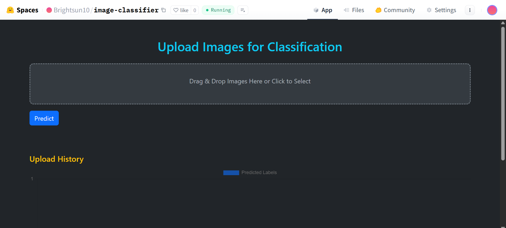

# 🧠 Image Classifier API with FastAPI + Docker

A fast, minimal image classification API powered by **FastAPI**, **PyTorch**, and **ResNet-50**. You can send image files to the `/predict` endpoint and get predictions instantly. Deployed via Docker and Hugging Face Spaces.

---

## 🚀 Features

- 📦 Docker-ready for portable deployment
- 🔥 Fast inference using PyTorch and ResNet-50
- 🎨 Classifies any image from the ImageNet dataset
- 🧼 Fully CORS-enabled for frontend integration
- 🌐 Includes static frontend for testing

---

## 🧪 Quick Start (Locally)

### 1. Clone the Repo

bash
git clone https://github.com/brightsun10/image-classifier.git
cd image-classifier

### 2. Download Pretrained Weights

wget https://download.pytorch.org/models/resnet50-0676ba61.pth -O resnet50_weights.pth

Also ensure imagenet_classes.txt exists (included in repo or generate):

wget https://raw.githubusercontent.com/pytorch/hub/master/imagenet_classes.txt

### 3. Run Locally

#### With Python:

pip install -r requirements.txt

uvicorn main:app --reload --port 7860

Visit: http://localhost:7860

#### With Docker:

docker build -t image-classifier .
docker run -p 7860:7860 image-classifier

---

## 🧾 File Structure

├── main.py                 # FastAPI app

├── Dockerfile              # Docker config

├── .huggingface.yml        # Hugging Face Spaces config

├── imagenet_classes.txt    # ImageNet class labels

├── resnet50_weights.pth    # Model weights (download separately)

├── requirements.txt        # Dependencies

├── static/

│   └── index.html          # Simple frontend UI

---

## 🌍 Deploy on Hugging Face Spaces

This project supports Hugging Face Spaces via Docker.

### ✅ Requirements

Dockerfile

.huggingface.yml

### Steps:
Push this repo to GitHub

Create a new Space on Hugging Face

Choose SDK: Docker

Link the repo or manually upload

Upload resnet50_weights.pth and imagenet_classes.txt if not included

---

## 📜 License
MIT License

---

## Author

Made with ❤️ by Nithin P (brightsun10)

---
